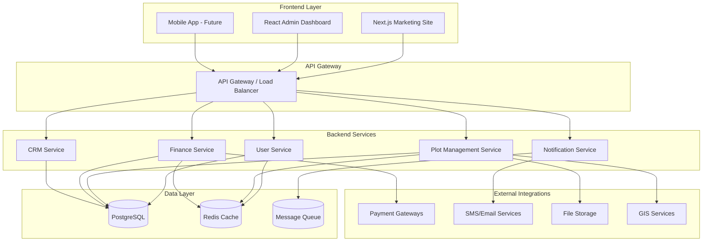
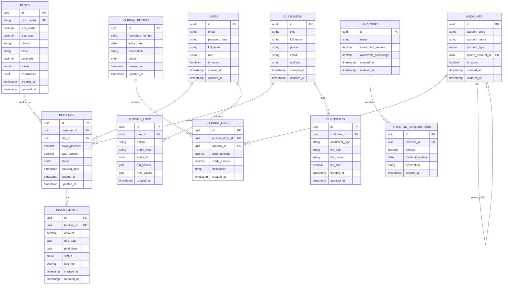
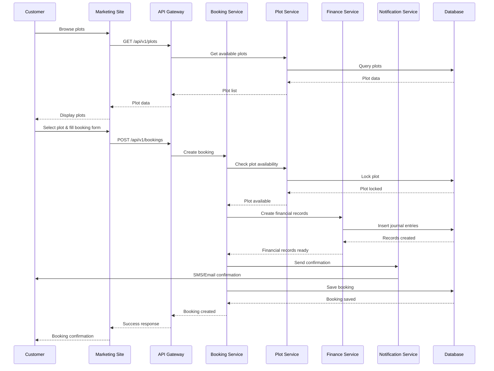
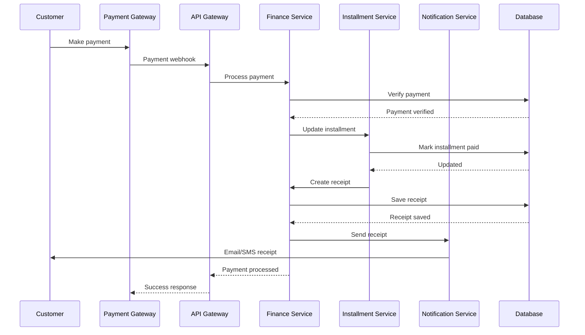
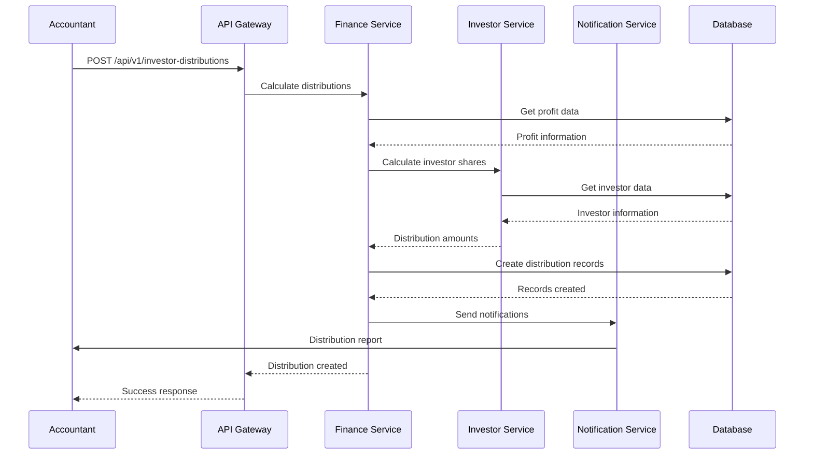

# Queen Hills Murree - Software Documentation

**Version:** 1.0  
**Date:** December 2024  
**Audience:** CTO + Development Team  
**Project:** Queen Hills Murree Web Application  

---

## Table of Contents

1. [Executive Summary](#executive-summary)
2. [System Architecture](#system-architecture)
3. [Feature Requirements](#feature-requirements)
4. [Data Model (ERD)](#data-model-erd)
5. [API Specification](#api-specification)
6. [Sequence Diagrams](#sequence-diagrams)
7. [UI/UX Wireframe Kit](#uiux-wireframe-kit)
8. [Non-Functional Requirements](#non-functional-requirements)
9. [DevOps & Deployment](#devops--deployment)
10. [Roadmap & Milestones](#roadmap--milestones)
11. [Glossary & Abbreviations](#glossary--abbreviations)

---

## Executive Summary

### Project Vision
Queen Hills Murree is a comprehensive real estate management platform designed to drive plot sales through an engaging public marketing site while providing robust internal accounting and finance capabilities for business operations.

### Target Users
- **External Users**: Potential buyers, investors, general public
- **Internal Users**: Sales agents, accountants, administrators, auditors
- **Stakeholders**: Investors, management team, regulatory bodies

### Success Metrics
- **Marketing Site**: 50% increase in lead generation, <2s page load times
- **Finance Suite**: 90% reduction in manual accounting tasks, real-time financial reporting
- **Business Impact**: 30% increase in plot sales, 100% audit compliance

---

## System Architecture

### High-Level Architecture



### Technology Stack

**Frontend:**
- Next.js 14 (React 18) for marketing site
- React Admin for dashboard
- TypeScript for type safety
- Tailwind CSS for styling
- Leaflet.js for interactive maps

**Backend:**
- Node.js with NestJS framework
- TypeScript for type safety
- JWT authentication with refresh tokens
- Role-based access control (RBAC)

**Database:**
- PostgreSQL 15 for primary data
- Redis for caching and sessions
- Message queue (RabbitMQ/Redis Streams)

**Infrastructure:**
- Docker containerization
- Kubernetes orchestration
- AWS cloud services
- Terraform for IaC

---

## Feature Requirements

### 1. Marketing Site

#### Hero Section
- **Murree Hill Imagery**: High-quality panoramic views of Murree hills
- **Dynamic Tagline**: Rotating value propositions
- **Call-to-Action**: "Book Your Dream Plot" button
- **Performance**: Optimized images, lazy loading
- **Asset Integration**:
  - **Background Video**: `Marketing_video_with music.mp4` as hero background
  - **Logo Integration**: Use finalized logo from `marketing_assets/logos/` directory
  - **Brand Guidelines**: Implement consistent branding across all sections

#### Interactive Master Plan Map
- **Technology**: SVG-based with Leaflet.js overlay
- **Features**:
  - Hover plot → size, price, status display
  - Click plot → detailed modal with booking option
  - Zoom/pan functionality
  - Phase/block filtering
- **Data Integration**: Real-time plot availability

#### Plot Size Filter
- **Filter Options**:
  - 3.5 Marla (≈ 87.5 sqm)
  - 5 Marla (≈ 125 sqm)
  - 10 Marla (≈ 250 sqm)
  - 1 Kanal (≈ 500 sqm)
- **Dynamic Results**: Instant filtering without page reload

#### Payment Plans
- **Display**: Responsive table with current rates
- **Download**: PDF generation with company branding
- **Updates**: Admin-controlled content management
- **Asset Integration**: 
  - Use `pricing_info.jpeg` as reference for payment plan display
  - Generate dynamic PDFs based on current pricing data
  - Include downloadable payment plan brochures

#### Booking Form
- **Lead Capture**: Name, phone, email, preferred plot
- **Validation**: Real-time form validation
- **Integration**: CRM system connection
- **Confirmation**: SMS/email confirmation

#### Virtual Tour & Gallery
- **Slider Component**: Touch-friendly image carousel
- **Categories**: Aerial views, amenities, construction progress
- **Optimization**: WebP format, responsive images
- **Asset Integration**:
  - **Video Content**: `Marketing_video_with music.mp4` for hero section background
  - **Gallery Images**: 
    - `WhatsApp Image 2025-07-26 at 1.04.12 AM.jpeg` - Site view
    - `WhatsApp Image 2025-07-26 at 1.04.11 AM.jpeg` - Landscape view
  - **Additional Videos**:
    - `WhatsApp Video 2025-07-26 at 1.04.13 AM.mp4` - Construction progress
    - `WhatsApp Video 2025-07-26 at 1.04.12 AM.mp4` - Site tour

#### Blog/News Section
- **CMS**: Markdown-based content management
- **SEO**: Meta tags, structured data, sitemap
- **Categories**: News, updates, testimonials
- **Search**: Full-text search functionality

#### Testimonials & Social Proof
- **Display**: Carousel with customer testimonials
- **Badges**: Trust indicators, certifications
- **Integration**: Real customer reviews

#### Performance Requirements
- **Mobile-First**: Responsive design
- **Load Time**: <2 seconds
- **Core Web Vitals**: Pass all metrics
- **SEO**: 90+ Lighthouse score

#### Marketing Assets Management
- **Asset Organization**:
  - **Logos**: Multiple versions in `marketing_assets/logos/` (not finalized)
  - **Pricing**: `pricing_info.jpeg` contains current payment plans
  - **Videos**: 
    - `Marketing_video_with music.mp4` (16MB) - Main marketing video
    - `WhatsApp Video 2025-07-26 at 1.04.13 AM.mp4` (1.4MB) - Construction progress
    - `WhatsApp Video 2025-07-26 at 1.04.12 AM.mp4` (1.8MB) - Site tour
  - **Images**:
    - `WhatsApp Image 2025-07-26 at 1.04.12 AM.jpeg` (198KB) - Site view
    - `WhatsApp Image 2025-07-26 at 1.04.11 AM.jpeg` (104KB) - Landscape view

- **Asset Integration Strategy**:
  - **Logo Selection**: Finalize logo from available options in logos directory
  - **Video Optimization**: Compress videos for web delivery while maintaining quality
  - **Image Processing**: Convert to WebP format for better performance
  - **Content Management**: Admin interface for updating marketing assets
  - **CDN Integration**: Serve optimized assets through CDN for global performance

### 2. Accounting & Finance Dashboard

#### User Roles & RBAC

| Role | Permissions | Access Level |
|------|-------------|--------------|
| Super Admin | Full system access | All modules |
| Accountant | Financial operations | Finance, Reports |
| Sales Agent | Customer management | CRM, Plot booking |
| Investor | Portfolio view | Investment reports |
| Buyer | Personal account | Booking history |
| Auditor | Read-only access | All modules (read) |

#### Inventory Module

**Plot Registry Features:**
- Geographic coordinates (latitude/longitude)
- Size specifications (Marla/Kanal with sqm equivalents)
- Phase and block assignment
- Pricing tiers and history
- Status tracking (Available/Reserved/Sold/Transferred)
- Ownership chain and transfer history

**Data Structure:**
```sql
CREATE TABLE plots (
    id UUID PRIMARY KEY,
    plot_number VARCHAR(20) UNIQUE,
    size_marla DECIMAL(5,2),
    size_sqm DECIMAL(8,2),
    phase VARCHAR(10),
    block VARCHAR(10),
    price_pkr DECIMAL(12,2),
    status plot_status_enum,
    coordinates POINT,
    created_at TIMESTAMP,
    updated_at TIMESTAMP
);
```

#### Booking & Installments

**Payment Schedule Management:**
- Down payment configuration (percentage-based)
- Quarterly/monthly installment schedules
- Auto-generated invoices with due dates
- Grace period logic (configurable days)
- Late fee calculation rules
- Automated reminders (SMS/email)

**Installment Flow:**
1. Booking confirmation
2. Down payment processing
3. Schedule generation
4. Invoice creation
5. Payment tracking
6. Reminder system

#### CRM System

**Lead Pipeline:**
- Lead capture from marketing site
- Lead scoring and qualification
- Activity tracking and notes
- Document management (CNIC scans, forms)
- Biometric verification integration
- Follow-up scheduling

**Document Vault:**
- Secure file storage (S3 compatible)
- Document categorization
- Version control
- Access permissions
- Audit trail

#### Finance & Accounting

**Chart of Accounts (IFRS-compliant):**
```
1000 - Assets
  1100 - Current Assets
    1110 - Cash and Cash Equivalents
    1120 - Accounts Receivable
  1200 - Non-Current Assets
    1210 - Property, Plant, Equipment

2000 - Liabilities
  2100 - Current Liabilities
    2110 - Accounts Payable
  2200 - Non-Current Liabilities

3000 - Equity
  3100 - Share Capital
  3200 - Retained Earnings

4000 - Revenue
  4100 - Plot Sales Revenue
  4200 - Interest Income

5000 - Expenses
  5100 - Marketing Expenses
  5200 - Administrative Expenses
  5300 - Construction Expenses
```

**Double-Entry Ledger:**
- Journal entry creation
- Batch processing
- Audit trail maintenance
- Reversal capabilities

**Financial Reports:**
- Cash flow statement (direct & indirect methods)
- Profit & Loss statement
- Balance sheet
- Trial balance
- Aged receivables/payables

**Bank Reconciliation:**
- Bank statement import
- Automatic matching
- Manual reconciliation tools
- Discrepancy reporting

**Investor Management:**
- Equity tracking
- Profit sharing calculations
- Distribution schedules
- ROI reporting

**Tax Handling:**
- VAT calculation (Pakistan rates)
- Withholding tax management
- Tax reporting
- Compliance monitoring

#### Reporting & Analytics

**Operational Reports:**
- Delinquency reports
- Inventory aging analysis
- Sales heatmap
- ROI calculations
- Forecast vs actual comparisons

**Dashboard Metrics:**
- Total plots sold
- Revenue trends
- Outstanding receivables
- Cash flow projections
- Customer acquisition costs

#### Integrations

**Payment Gateways:**
- JazzCash integration
- Easypaisa integration
- 1LINK IBFT support
- Payment status tracking
- Reconciliation automation

**Communication Services:**
- SMS via Jazz/Infobip
- Transactional email via SendGrid
- Template management
- Delivery tracking

**GIS Integration:**
- Shapefile support
- Map overlay capabilities
- Coordinate validation
- Spatial queries

**File Storage:**
- S3-compatible storage (Wasabi)
- CDN integration
- Backup automation
- Access control
- **Marketing Assets Pipeline**:
  - Automated image optimization (WebP conversion)
  - Video compression for web delivery
  - Logo version management
  - Asset metadata tracking

#### Audit & Compliance

**Activity Logging:**
- User action tracking
- Data change history
- Login/logout events
- API access logs

**Data Protection:**
- GDPR compliance measures
- PDPA alignment
- Data encryption at rest/transit
- Privacy controls

**Backup Strategy:**
- Nightly encrypted backups
- Point-in-time recovery
- Disaster recovery testing
- Retention policies

---

## Data Model (ERD)



---

## API Specification

### Authentication

**JWT Token Structure:**
```json
{
  "access_token": "eyJhbGciOiJIUzI1NiIsInR5cCI6IkpXVCJ9...",
  "refresh_token": "eyJhbGciOiJIUzI1NiIsInR5cCI6IkpXVCJ9...",
  "expires_in": 3600,
  "token_type": "Bearer"
}
```

### REST API Endpoints

#### Marketing Site APIs

**Get Plots (Public)**
```http
GET /api/v1/plots
Authorization: Bearer {token}
Content-Type: application/json

Query Parameters:
- size_marla: number (optional)
- phase: string (optional)
- status: string (optional)
- page: number (default: 1)
- limit: number (default: 20)

Response:
{
  "data": [
    {
      "id": "uuid",
      "plot_number": "A-001",
      "size_marla": 5.0,
      "size_sqm": 125.0,
      "phase": "Phase 1",
      "block": "A",
      "price_pkr": 2500000,
      "status": "available",
      "coordinates": {
        "lat": 33.9075,
        "lng": 73.3908
      }
    }
  ],
  "pagination": {
    "page": 1,
    "limit": 20,
    "total": 150,
    "pages": 8
  }
}
```

**Create Lead**
```http
POST /api/v1/leads
Content-Type: application/json

Request Body:
{
  "full_name": "Ahmed Khan",
  "phone": "+923001234567",
  "email": "ahmed@example.com",
  "preferred_plot_id": "uuid",
  "message": "Interested in 5 marla plot"
}

Response:
{
  "id": "uuid",
  "status": "created",
  "message": "Lead created successfully"
}
```

**Get Marketing Assets**
```http
GET /api/v1/marketing/assets
Content-Type: application/json

Response:
{
  "videos": [
    {
      "id": "uuid",
      "name": "Marketing_video_with music.mp4",
      "url": "https://cdn.queenhills.com/videos/marketing-video.mp4",
      "thumbnail": "https://cdn.queenhills.com/thumbnails/marketing-video.jpg",
      "category": "hero_background"
    }
  ],
  "images": [
    {
      "id": "uuid",
      "name": "Site View",
      "url": "https://cdn.queenhills.com/images/site-view.webp",
      "thumbnail": "https://cdn.queenhills.com/thumbnails/site-view.jpg",
      "category": "gallery"
    }
  ],
  "logos": [
    {
      "id": "uuid",
      "name": "Queen Hills Logo",
      "url": "https://cdn.queenhills.com/logos/queen-hills-logo.png",
      "variants": ["light", "dark", "monochrome"]
    }
  ],
  "pricing": {
    "image_url": "https://cdn.queenhills.com/pricing/pricing-info.webp",
    "last_updated": "2024-12-01T00:00:00Z"
  }
}

#### Dashboard APIs

**Get Dashboard Stats**
```http
GET /api/v1/dashboard/stats
Authorization: Bearer {token}

Response:
{
  "total_plots": 500,
  "sold_plots": 150,
  "available_plots": 350,
  "total_revenue": 375000000,
  "pending_receivables": 45000000,
  "monthly_sales": [
    {"month": "2024-01", "sales": 12},
    {"month": "2024-02", "sales": 15}
  ]
}
```

**Create Booking**
```http
POST /api/v1/bookings
Authorization: Bearer {token}
Content-Type: application/json

Request Body:
{
  "customer_id": "uuid",
  "plot_id": "uuid",
  "down_payment": 500000,
  "payment_plan": "quarterly",
  "installment_amount": 250000
}

Response:
{
  "id": "uuid",
  "booking_number": "BK-2024-001",
  "status": "confirmed",
  "installments": [
    {
      "id": "uuid",
      "amount": 250000,
      "due_date": "2024-04-01",
      "status": "pending"
    }
  ]
}
```

### GraphQL Schema

```graphql
type Query {
  plots(
    sizeMarla: Float
    phase: String
    status: PlotStatus
    page: Int
    limit: Int
  ): PlotConnection!
  
  dashboardStats: DashboardStats!
  bookings(customerId: ID): [Booking!]!
  customers: [Customer!]!
}

type Mutation {
  createLead(input: CreateLeadInput!): Lead!
  createBooking(input: CreateBookingInput!): Booking!
  createJournalEntry(input: CreateJournalEntryInput!): JournalEntry!
  updatePlotStatus(id: ID!, status: PlotStatus!): Plot!
}

type Plot {
  id: ID!
  plotNumber: String!
  sizeMarla: Float!
  sizeSqm: Float!
  phase: String!
  block: String!
  pricePkr: Float!
  status: PlotStatus!
  coordinates: Coordinates!
  createdAt: DateTime!
  updatedAt: DateTime!
}

type Booking {
  id: ID!
  customer: Customer!
  plot: Plot!
  downPayment: Float!
  totalAmount: Float!
  status: BookingStatus!
  installments: [Installment!]!
  createdAt: DateTime!
}

type Customer {
  id: ID!
  cnic: String!
  fullName: String!
  phone: String!
  email: String!
  bookings: [Booking!]!
  documents: [Document!]!
}

enum PlotStatus {
  AVAILABLE
  RESERVED
  SOLD
  TRANSFERRED
}

enum BookingStatus {
  PENDING
  CONFIRMED
  CANCELLED
  COMPLETED
}
```

---

## Sequence Diagrams

### 1. Plot Booking Flow



### 2. Installment Payment Flow



### 3. Investor Cash Distribution Flow



---

## UI/UX Wireframe Kit

### Marketing Site Wireframes

**Hero Section (Figma: Marketing-Hero)**
- Full-width Murree hills background image
- Centered tagline with CTA button
- Navigation menu (top right)
- Mobile-responsive hamburger menu

**Interactive Map (Figma: Marketing-Map)**
- SVG-based master plan overlay
- Plot hover states with tooltips
- Filter panel (left sidebar)
- Zoom controls (bottom right)
- Plot details modal

**Payment Plans (Figma: Marketing-Payment)**
- Responsive table layout
- Download PDF button
- Comparison features
- Mobile card layout

**Booking Form (Figma: Marketing-Booking)**
- Multi-step form wizard
- Real-time validation
- Progress indicator
- Success confirmation page

### Dashboard Wireframes

**Login/Authentication (Figma: Dashboard-Login)**
- Clean login form
- 2FA integration
- Password reset flow
- Remember me option

**Main Dashboard (Figma: Dashboard-Main)**
- KPI cards (top row)
- Charts and graphs (middle)
- Recent activities (bottom)
- Quick actions sidebar

**Plot Management (Figma: Dashboard-Plots)**
- Data table with filters
- Bulk actions
- Export functionality
- Map view toggle

**Financial Reports (Figma: Dashboard-Finance)**
- Tabbed interface
- Date range picker
- Export options
- Print-friendly layouts

**CRM Interface (Figma: Dashboard-CRM)**
- Kanban board view
- List view toggle
- Customer profiles
- Activity timeline

---

## Non-Functional Requirements

### Performance Requirements

**Response Times:**
- Marketing site: <2 seconds page load
- Dashboard: <1 second for data queries
- API endpoints: <500ms average response
- Map interactions: <100ms hover response

**Scalability:**
- Support 10,000 concurrent users
- Horizontal scaling with Kubernetes
- Auto-scaling based on CPU/memory usage
- CDN for static assets

**Database Performance:**
- Query optimization with indexes
- Connection pooling
- Read replicas for reporting
- Caching strategy (Redis)

### Security Requirements

**Authentication:**
- JWT tokens with refresh mechanism
- 2FA for admin accounts
- Session management
- Password complexity requirements

**Authorization:**
- Role-based access control (RBAC)
- Resource-level permissions
- API rate limiting
- IP whitelisting for admin access

**Data Protection:**
- Encryption at rest (AES-256)
- TLS 1.3 for data in transit
- Secure file uploads
- GDPR compliance measures

**Audit & Compliance:**
- Comprehensive activity logging
- Immutable audit trail
- Regular security assessments
- Penetration testing

### Reliability Requirements

**Availability:**
- 99.9% uptime SLA
- Multi-zone deployment
- Automatic failover
- Health check monitoring

**Backup & Recovery:**
- RPO ≤ 15 minutes
- RTO ≤ 1 hour
- Point-in-time recovery
- Disaster recovery testing

**Monitoring:**
- Grafana dashboards
- Loki for log aggregation
- Prometheus metrics
- Alert management

### Usability Requirements

**Accessibility:**
- WCAG 2.1 AA compliance
- Keyboard navigation
- Screen reader support
- High contrast mode

**Mobile Experience:**
- Responsive design
- Touch-friendly interfaces
- Offline capabilities
- Progressive Web App features

---

## DevOps & Deployment

### CI/CD Pipeline

**GitHub Actions Workflow:**
```yaml
name: Deploy to Production
on:
  push:
    branches: [main]

jobs:
  test:
    runs-on: ubuntu-latest
    steps:
      - uses: actions/checkout@v3
      - name: Setup Node.js
        uses: actions/setup-node@v3
        with:
          node-version: '18'
      - name: Install dependencies
        run: npm ci
      - name: Run tests
        run: npm test
      - name: Run linting
        run: npm run lint

  build:
    needs: test
    runs-on: ubuntu-latest
    steps:
      - uses: actions/checkout@v3
      - name: Build Docker images
        run: |
          docker build -t queen-hills-frontend ./frontend
          docker build -t queen-hills-backend ./backend
      - name: Push to registry
        run: |
          docker push ${{ secrets.REGISTRY }}/queen-hills-frontend
          docker push ${{ secrets.REGISTRY }}/queen-hills-backend

  deploy:
    needs: build
    runs-on: ubuntu-latest
    steps:
      - name: Deploy to Kubernetes
        run: |
          kubectl apply -f k8s/
          kubectl rollout restart deployment/queen-hills-frontend
          kubectl rollout restart deployment/queen-hills-backend
```

### Infrastructure as Code (Terraform)

**Main Configuration:**
```hcl
# AWS Provider
provider "aws" {
  region = "us-east-1"
}

# VPC Configuration
resource "aws_vpc" "main" {
  cidr_block = "10.0.0.0/16"
  
  tags = {
    Name = "queen-hills-vpc"
    Environment = "production"
  }
}

# EKS Cluster
resource "aws_eks_cluster" "main" {
  name     = "queen-hills-cluster"
  role_arn = aws_iam_role.eks_cluster.arn
  version  = "1.27"

  vpc_config {
    subnet_ids = [
      aws_subnet.public_1.id,
      aws_subnet.public_2.id,
      aws_subnet.private_1.id,
      aws_subnet.private_2.id
    ]
  }
}

# RDS PostgreSQL
resource "aws_db_instance" "postgresql" {
  identifier        = "queen-hills-db"
  engine            = "postgres"
  engine_version    = "15.4"
  instance_class    = "db.t3.large"
  allocated_storage = 100
  
  db_name  = "queenhills"
  username = var.db_username
  password = var.db_password
  
  vpc_security_group_ids = [aws_security_group.rds.id]
  db_subnet_group_name   = aws_db_subnet_group.main.name
}

# ElastiCache Redis
resource "aws_elasticache_cluster" "redis" {
  cluster_id           = "queen-hills-redis"
  engine               = "redis"
  node_type            = "cache.t3.micro"
  num_cache_nodes      = 1
  parameter_group_name = "default.redis7"
  port                 = 6379
}
```

### Kubernetes Deployment

**Frontend Deployment:**
```yaml
apiVersion: apps/v1
kind: Deployment
metadata:
  name: queen-hills-frontend
  namespace: production
spec:
  replicas: 3
  selector:
    matchLabels:
      app: queen-hills-frontend
  template:
    metadata:
      labels:
        app: queen-hills-frontend
    spec:
      containers:
      - name: frontend
        image: queen-hills-frontend:latest
        ports:
        - containerPort: 3000
        env:
        - name: NEXT_PUBLIC_API_URL
          value: "https://api.queenhills.com"
        resources:
          requests:
            memory: "256Mi"
            cpu: "250m"
          limits:
            memory: "512Mi"
            cpu: "500m"
        livenessProbe:
          httpGet:
            path: /health
            port: 3000
          initialDelaySeconds: 30
          periodSeconds: 10
        readinessProbe:
          httpGet:
            path: /ready
            port: 3000
          initialDelaySeconds: 5
          periodSeconds: 5
```

**Backend Deployment:**
```yaml
apiVersion: apps/v1
kind: Deployment
metadata:
  name: queen-hills-backend
  namespace: production
spec:
  replicas: 3
  selector:
    matchLabels:
      app: queen-hills-backend
  template:
    metadata:
      labels:
        app: queen-hills-backend
    spec:
      containers:
      - name: backend
        image: queen-hills-backend:latest
        ports:
        - containerPort: 3001
        env:
        - name: DATABASE_URL
          valueFrom:
            secretKeyRef:
              name: db-secret
              key: url
        - name: REDIS_URL
          valueFrom:
            secretKeyRef:
              name: redis-secret
              key: url
        resources:
          requests:
            memory: "512Mi"
            cpu: "500m"
          limits:
            memory: "1Gi"
            cpu: "1000m"
```

### Monitoring & Observability

**Grafana Dashboard Configuration:**
```json
{
  "dashboard": {
    "title": "Queen Hills Murree - System Overview",
    "panels": [
      {
        "title": "Application Response Time",
        "type": "graph",
        "targets": [
          {
            "expr": "rate(http_request_duration_seconds_sum[5m])",
            "legendFormat": "{{method}} {{route}}"
          }
        ]
      },
      {
        "title": "Database Connections",
        "type": "graph",
        "targets": [
          {
            "expr": "pg_stat_database_numbackends",
            "legendFormat": "{{datname}}"
          }
        ]
      },
      {
        "title": "Error Rate",
        "type": "graph",
        "targets": [
          {
            "expr": "rate(http_requests_total{status=~\"5..\"}[5m])",
            "legendFormat": "5xx Errors"
          }
        ]
      }
    ]
  }
}
```

---

## Roadmap & Milestones

### Phase 1: MVP (90 Days)

**Week 1-4: Foundation**
- [ ] Project setup and architecture
- [ ] Database schema design
- [ ] Basic authentication system
- [ ] Core API development

**Week 5-8: Marketing Site**
- [ ] Hero section and navigation
- [ ] Interactive map implementation
- [ ] Plot filtering and display
- [ ] Booking form development
- [ ] Marketing assets integration
- [ ] Logo finalization and implementation
- [ ] Video optimization and embedding
- [ ] Payment plan display using pricing_info.jpeg

**Week 9-12: Basic Dashboard**
- [ ] User management
- [ ] Plot inventory management
- [ ] Basic booking system
- [ ] Simple reporting

**Week 13-16: Finance Module**
- [ ] Chart of accounts setup
- [ ] Basic journal entries
- [ ] Payment tracking
- [ ] Simple financial reports

**Week 17-20: CRM & Integrations**
- [ ] Lead management
- [ ] Document upload
- [ ] SMS/Email integration
- [ ] Payment gateway integration

**Week 21-24: Testing & Deployment**
- [ ] Comprehensive testing
- [ ] Performance optimization
- [ ] Security audit
- [ ] Production deployment

### Phase 2: Beta (6 Months)

**Month 1-2: Advanced Features**
- [ ] Advanced reporting and analytics
- [ ] Investor management
- [ ] Audit trail implementation
- [ ] Advanced security features

**Month 3-4: Mobile App**
- [ ] React Native mobile app
- [ ] Push notifications
- [ ] Offline capabilities
- [ ] Biometric authentication

**Month 5-6: Enterprise Features**
- [ ] Multi-tenant architecture
- [ ] Advanced integrations
- [ ] Custom workflows
- [ ] API marketplace

### Phase 3: General Availability

**Month 7-8: Scale & Optimize**
- [ ] Performance optimization
- [ ] Advanced monitoring
- [ ] Disaster recovery
- [ ] Compliance certifications

**Month 9-12: Market Expansion**
- [ ] Multi-language support
- [ ] Regional compliance
- [ ] Partner integrations
- [ ] White-label solutions

### Success Metrics

**Technical Metrics:**
- 99.9% uptime
- <2s page load times
- <500ms API response times
- Zero security incidents

**Business Metrics:**
- 50% increase in lead generation
- 30% increase in plot sales
- 90% reduction in manual tasks
- 100% audit compliance

---

## Glossary & Abbreviations

### Technical Terms

**API** - Application Programming Interface
**CDN** - Content Delivery Network
**CI/CD** - Continuous Integration/Continuous Deployment
**CRM** - Customer Relationship Management
**ERD** - Entity Relationship Diagram
**GDPR** - General Data Protection Regulation
**GIS** - Geographic Information System
**IaC** - Infrastructure as Code
**IFRS** - International Financial Reporting Standards
**JWT** - JSON Web Token
**MVP** - Minimum Viable Product
**PDPA** - Personal Data Protection Act
**PWA** - Progressive Web Application
**RBAC** - Role-Based Access Control
**RPO** - Recovery Point Objective
**RTO** - Recovery Time Objective
**SLA** - Service Level Agreement
**SMS** - Short Message Service
**VAT** - Value Added Tax
**WCAG** - Web Content Accessibility Guidelines

### Business Terms

**CNIC** - Computerized National Identity Card
**IBFT** - Inter-Bank Fund Transfer
**Kanal** - Traditional land measurement (≈ 500 sqm)
**Marla** - Traditional land measurement (≈ 25 sqm)
**PKR** - Pakistani Rupee
**ROI** - Return on Investment

### Real Estate Terms

**Block** - Subdivision of a phase
**Phase** - Development stage
**Plot** - Individual land parcel
**Master Plan** - Overall development layout
**Transfer** - Change of ownership

---

## Appendices

### A. API Rate Limits

| Endpoint Category | Rate Limit | Window |
|------------------|------------|---------|
| Public APIs | 1000 requests/hour | 1 hour |
| Authentication | 10 requests/minute | 1 minute |
| Admin APIs | 5000 requests/hour | 1 hour |
| File Upload | 10 requests/minute | 1 minute |

### B. Database Indexes

```sql
-- Performance optimization indexes
CREATE INDEX idx_plots_status ON plots(status);
CREATE INDEX idx_plots_phase_block ON plots(phase, block);
CREATE INDEX idx_bookings_customer ON bookings(customer_id);
CREATE INDEX idx_installments_due_date ON installments(due_date);
CREATE INDEX idx_journal_entries_date ON journal_entries(entry_date);
CREATE INDEX idx_activity_logs_user ON activity_logs(user_id);
CREATE INDEX idx_activity_logs_created ON activity_logs(created_at);
```

### C. Security Checklist

- [ ] HTTPS enforcement
- [ ] CORS configuration
- [ ] Input validation
- [ ] SQL injection prevention
- [ ] XSS protection
- [ ] CSRF protection
- [ ] Rate limiting
- [ ] Security headers
- [ ] Regular security updates
- [ ] Penetration testing

### D. Performance Checklist

- [ ] Image optimization
- [ ] Code splitting
- [ ] Lazy loading
- [ ] Caching strategy
- [ ] Database optimization
- [ ] CDN implementation
- [ ] Compression
- [ ] Minification
- [ ] Bundle analysis
- [ ] Core Web Vitals optimization

---

**Document Version:** 1.0  
**Last Updated:** December 2024  
**Next Review:** March 2025  
**Contact:** Development Team 